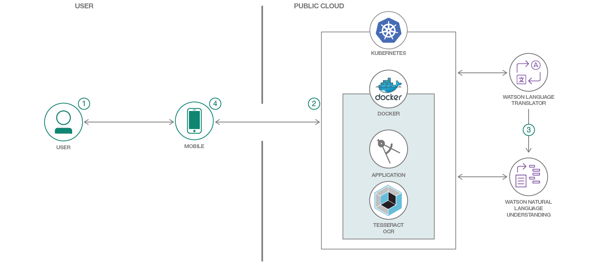

# Build a hybrid mobile app that can capture an image, recognize and translate text using Tesseract OCR & Watson Language Translator

In this Code Pattern, we will create a hybrid mobile app using Apache Cordova and Node.js server application running on IBM Cloud Kubernetes service that uses Tesseract OCR to recognize text in images and Watson Language Translator to translate the recognized text. This mobile app translates the recognized text from the images captured or uploaded from the photo album.

When the reader has completed this Code Pattern, they will understand how to:

* Use the Cordova mobile framework to build and deploy mobile app.
* Create Node.js apps that capture, recognize and translate text using Watson services.
* Deploy Tesseract OCR on IBM Cloud Kubernetes service to recognize text and bind Watson service to cluster.
* Translate recognized text using Watson Language Translator.



## Flow
1. The user interacts with the mobile app and captures an image or selects an image from the photo album.
2. The image is passed to the Node.js server application that is running on IBM Cloud Kubernetes service which uses Tesseract OCR to recognize text in an image.
3. Watson Language Translator translates the recognized text.
4. Recognized text and language translator result is returned to the mobile app for display.

## Included components
* [IBM Cloud Container Service](https://console.bluemix.net/docs/containers/container_index.html): IBM Bluemix Container Service manages highly available apps inside Docker containers and Kubernetes clusters on the IBM Cloud.
* [Watson Language Translator](https://www.ibm.com/watson/services/language-translator/): IBM Watson Language Translator is a service that enables you to dynamically translate news,patents or conversational documents.

## Featured technologies
* [Apache Cordova](https://cordova.apache.org/): An an open-source mobile development framework to build hybrid mobile apps.
* [Node.js](https://nodejs.org/): An open-source JavaScript run-time environment for executing server-side JavaScript code.
* [Tesseract OCR](https://nodejs.org/): An open-source Optical Character Recognition(OCR) engine.

# Watch the Video

TODO

# Steps

This Code Pattern contains several pieces. The Node.js server application running on IBM Cloud Kubernetes service communicates with the Tesseract OCR and Watson Language Translator. Mobile application is built locally and run on the Android/iOS phone.

## 1. Clone the repo

Clone the `snap-and-translate` repo locally. In a terminal, run:

```
$ git clone https://github.ibm.com/riyamaro/snap-and-translate.git
$ cd snap-and-translate
```

## 2. Run Server application in container

Run this application in a container with Kubernetes on IBM Cloud using these [instructions](doc/source/Container.md).

## 3. Deploy mobile application

Deploy mobile application using thse [instructions](doc/source/Mobileapp.md).

# Sample output

  


# Troubleshooting

* `cordova run android` error: Failure [INSTALL_FAILED_UPDATE_INCOMPATIBLE]

> The `Calorie Counter` app is already installed on your phone and incompatible with the version you are now trying to run. Uninstall the current version and try again.

* `cordova run android` error: No target specified and no devices found, deploying to emulator

> Ensure that your phone is plugged into your computer and you can access it from the Android File Transfer utility (see Step #6 above).

* How to determine proper values for environment variables:

Open `Android Studio` and navigate to `File` -> `Project Structure` -> `SDK
Location`. This location value will serve as the base for your environment variables. For example, if the location is `/users/joe/Android/sdk`, then:

```
$ export ANDROID_HOME=/users/joe/Android/sdk
$ export ANDROID_SDK_HOME=/users/joe/Android/sdk/platforms/android-<api-level>
$ export PATH=${PATH}:/users/joe/Android/sdk/platform-tools:/users/joe/Android/sdk/tools
```

* `ibmcloud cs cluster-service-bind --cluster <cluster_name> --namespace default --service <watson_service_name>`

Error: "This IBM cloud service does not support the Cloud Foundry service keys API and cannot be added to your Cluster"

This error message is likely occurring because the service instance has not fully instantiated. Please wait a few minutes and then try binding the service instance again.

# Links

* [Watson Node.js SDK](https://github.com/watson-developer-cloud/node-sdk):Visit the Node.js library to access IBM Watson services.
* [Create Kubernetes cluster](https://console.bluemix.net/docs/containers/cs_tutorials.html#objectives): Tutorial- Creating Kubernetes Cluster and adding Watson service to cluster.
* [Sample Node.js application for Language Translator](https://github.com/watson-developer-cloud/language-translator-nodejs): Sample Node.JS application for Watson Language Translator service

# Learn more

* **Artificial Intelligence Code Patterns**: Enjoyed this Code Pattern? Check out our other [AI Code Patterns](https://developer.ibm.com/code/technologies/artificial-intelligence/).
* **AI and Data Code Pattern Playlist**: Bookmark our [playlist](https://www.youtube.com/playlist?list=PLzUbsvIyrNfknNewObx5N7uGZ5FKH0Fde) with all of our Code Pattern videos
* **With Watson**: Want to take your Watson app to the next level? Looking to utilize Watson Brand assets? [Join the With Watson program](https://www.ibm.com/watson/with-watson/) to leverage exclusive brand, marketing, and tech resources to amplify and accelerate your Watson embedded commercial solution.

# License
[Apache 2.0](LICENSE)
